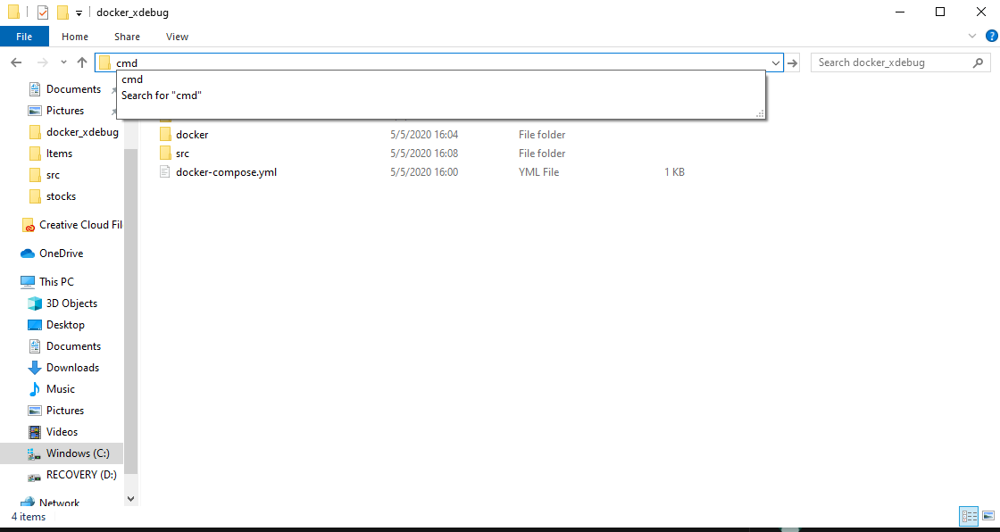
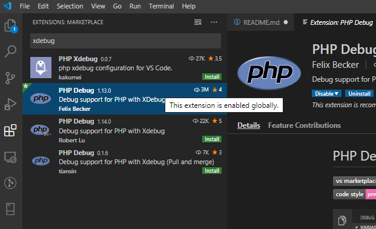
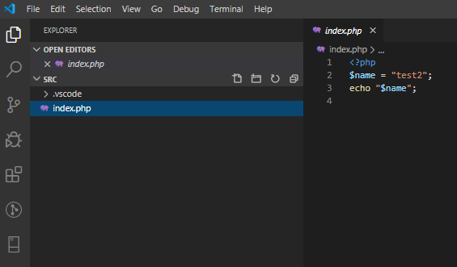
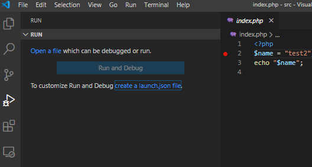
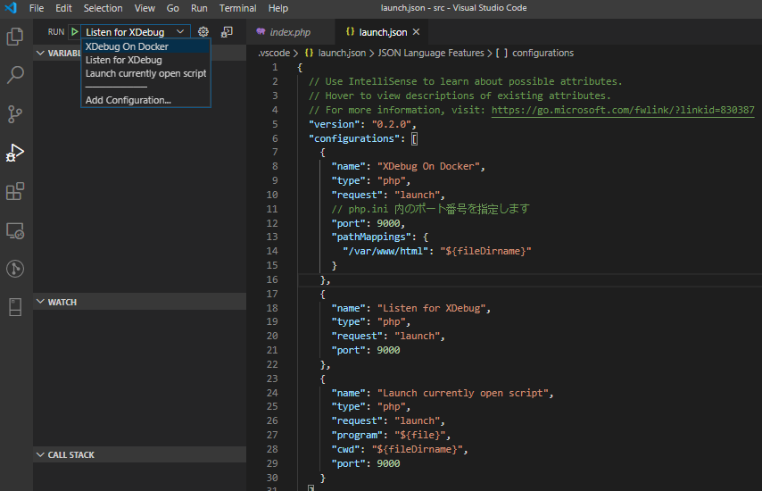
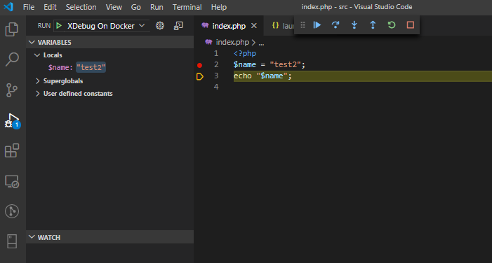

- [Docker の導入](#docker-%e3%81%ae%e5%b0%8e%e5%85%a5)
- [docker file の利用](#docker-file-%e3%81%ae%e5%88%a9%e7%94%a8)
- [VSCode 側の設定](#vscode-%e5%81%b4%e3%81%ae%e8%a8%ad%e5%ae%9a)
- [docker の説明](#docker-%e3%81%ae%e8%aa%ac%e6%98%8e)
  - [起動中コンテナの確認](#%e8%b5%b7%e5%8b%95%e4%b8%ad%e3%82%b3%e3%83%b3%e3%83%86%e3%83%8a%e3%81%ae%e7%a2%ba%e8%aa%8d)
  - [コンテナの停止](#%e3%82%b3%e3%83%b3%e3%83%86%e3%83%8a%e3%81%ae%e5%81%9c%e6%ad%a2)
  - [ベースイメージの変更](#%e3%83%99%e3%83%bc%e3%82%b9%e3%82%a4%e3%83%a1%e3%83%bc%e3%82%b8%e3%81%ae%e5%a4%89%e6%9b%b4)

# Docker の導入

- `Windows 10 Pro`であれば`Docker for Windows`をインストールします。
  - https://www.docker.com/products/docker-desktop
  - `Windows 10 Home`では`Docker`を利用することはできません。
- `Docker`を`Windows`で利用するためには、`Hyper-V`および仮想化機能を有効にする必要があります。
  - `Task Manager`の`CPU`項目から現在の状態を確認できます。
  - 仮想化を有効にするために BIOS の設定が必要です。以下の記事を参考にしてください。
    - https://qiita.com/naonaka/items/c8d076170100ee2ea63c
- 仮想化の設定を行い、`Docker for Desktop`が起動できたなら、次のステップに進みます。

# docker file の利用

- このリポジトリの`docker_xdebug`フォルダを任意の場所に導入します。
  - `git`であれば普通に`clone`, そうでなければ`ZIP`ダウンロードをご利用ください。
- 導入フォルダ内(`docker-compose.yml`の配置されたフォルダ)でコマンドプロンプト(あるいは bash, powershell など)を開きます。



- CUI で以下のコマンドを実行します。
  ```
  docker-compose up -d
  ```
- イメージの初期構築が行われます。
  - このイメージは、`XDebug`の設定を行った`apache`,`php7.4`のイメージです。
    - 違うバージョンを利用したい場合、`Dockerfile`の`FROM php:7.4-apache`の箇所を変更します。
  - 作成したコンテナは、利用するソースコードとして`src`ディレクトリをマウントします。
    - 初期状態では`index.php`を配置してあります。これは任意のアプリケーションを配置してもよいですし、コンテナ起動中に編集を行うこともできます。
- 展開が完了したならば、イメージが起動しています。
  - ブラウザから[http://localhost:8081](http://localhost:8081)にアクセスすると`index.php`がオープンします。
- ここまでで、`docker`の`apache`サーバにアクセスを行う手順が完了しています。
  - 続いて、`VSCode`を利用して`index.php`のデバッグを行ってみます。

# VSCode 側の設定

- デバッグを実行したいフォルダ（今回は`src`）を`VSCode`で開きます。
  - 上記のコマンドプロンプトで`code src`と入力して開いてしまうのが便利です。
- `XDebug`を利用するための拡張機能を導入します。

  - `xdebug`などと検索し、`PHP Debug`拡張をインストールします。
  - 

- 導入が終わったら、`index.php`を開きます。
  - 
- `デバッグ`タブを開き、`create launch.json`を実行します。メニューは`PHP`を選択します。
  - 
- `Add Configuration`から設定の追加を行います。

  - 以下の設定を追加します。
  - **`launch.json`**
    ```json
        {
          "name": "XDebug On Docker",
          "type": "php",
          "request": "launch",
          "port": 9000,
          "pathMappings": {
            "/var/www/html": "${fileDirname}"
          }
        },
    ```
  - 

- 追加した XDebug On Docker のプロファイルを使用します。(上記画像参考)
  - `vscode`で行ったあらゆるファイル変更は`Ctrl+S`などで明示的に保存を行わない限り反映されません。
  - ので、`XDebug On Docker`が表示されない場合、`launch.json`の変更を保存しているか確認されることをおすすめします。
- 次に、`index.php`にブレークポイントを追加します。

  ```
  $name = "test2";
  ```

  - にて F9 を押下することでブレークポイントをセットします。
  - ブラウザから localhost:8081 にアクセスし、当該ページを表示します。
    - デバッグを開始（再生マーク押下）して、ページを更新すると、ブレークポイントがヒットし、`$name`の変数の状態を確認できます。
    - 
    - ヒットしない場合、停止（□）してプロファイルが`XDebug On Docker`であることを確認し、もう一度をデバッグ開始を押しなおしてみるといいかもしれません。

# docker の説明

### 起動中コンテナの確認

```
docker ps
```

と入力すると、現在実行中のコンテナが表示されます。
たとえば、起動中のコンテナのコンテナ名が`docker_xdebug_php_1`であったならば、

### コンテナの停止

```
docker stop docker_xdebug_php_1
```

と入力することで起動中のコンテナを停止することができます。

### ベースイメージの変更

利用するイメージの変更などを行う場合、

```
docker rm docker_xdebug_php_1
```

を行ったうえで、

```
docker-compose build
```

を実行して再度イメージのキャッシュを生成します。
